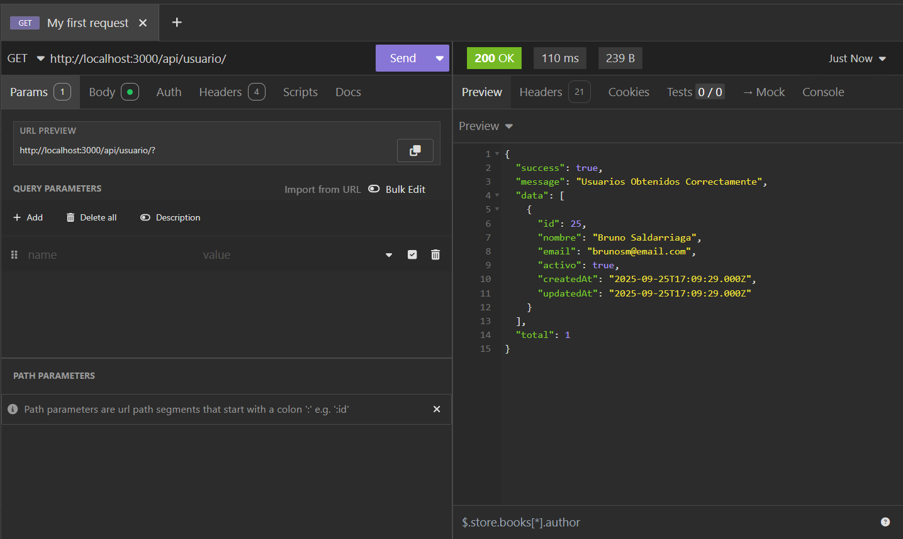
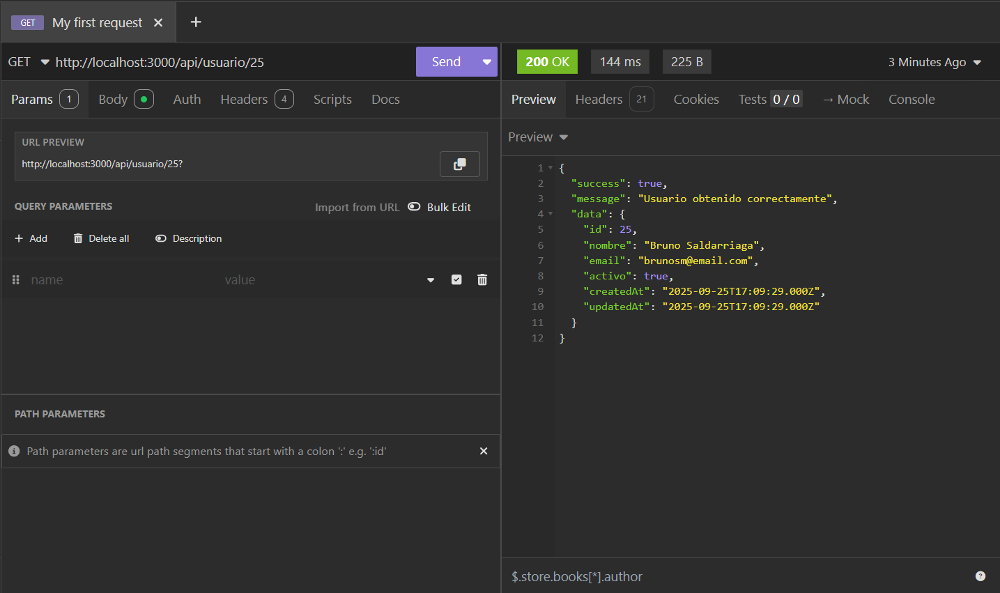
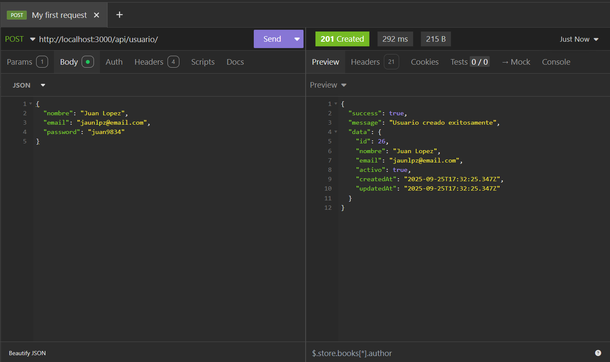
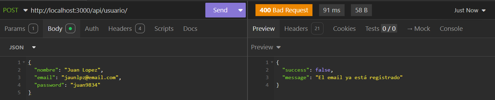
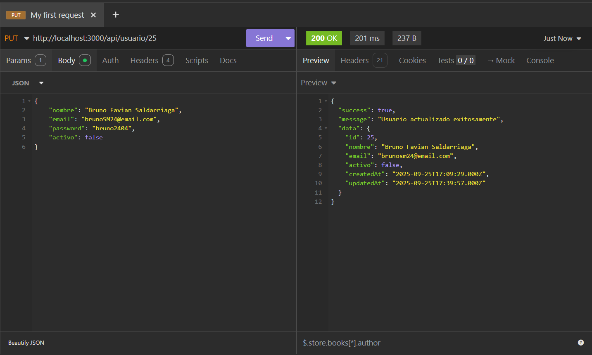
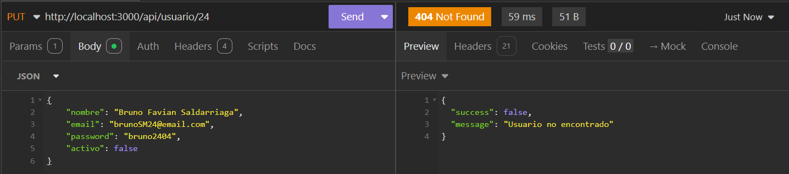
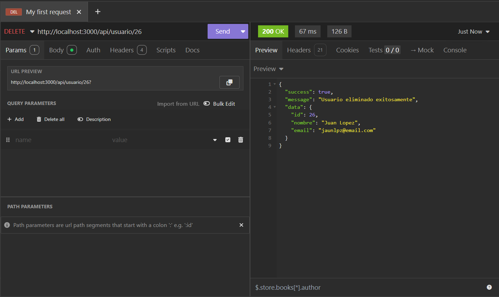
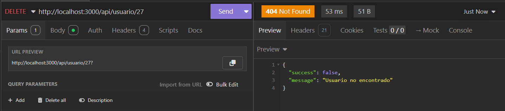

# Mi API - Sistema de Gestión de Usuarios

Una API REST desarrollada con Node.js para la gestión de usuarios con base de datos MySQL.

## Características

- API REST completa con operaciones CRUD
- Encriptación de contraseñas con bcrypt
- Validación de emails únicos
- Base de datos MySQL con Sequelize ORM
- Middleware de seguridad con Helmet
- CORS configurado
- Logging de requests


## Documentación de la API

### Base URL
```
http://localhost:3000/api/usuario
```

### Endpoints Disponibles

#### 1. Obtener todos los usuarios
```http
GET http://localhost:3000/api/usuario
```

**Respuesta exitosa (200):**
```json
{
  "success": true,
  "message": "Usuarios Obtenidos Correctamente",
  "data": [
    {
        "id": 25,
        "nombre": "Bruno Saldarriaga",
        "email": "brunosm@email.com",
        "activo": true,
        "createdAt": "2025-09-25T17:09:29.000Z",
        "updatedAt": "2025-09-25T17:09:29.000Z"
    }
  ],
  "total": 1
}
```

<p align="center">
  <br>
</p>

#### 2. Obtener usuario por ID
```http
GET http://localhost:3000/api/usuario/:id
GET http://localhost:3000/api/usuario/25
```

**Parámetros:**
- `id`: ID del usuario a obtener

**Respuesta exitosa (200):**
```json
{
	"success": true,
	"message": "Usuario obtenido correctamente",
	"data": {
		"id": 25,
		"nombre": "Bruno Saldarriaga",
		"email": "brunosm@email.com",
		"activo": true,
		"createdAt": "2025-09-25T17:09:29.000Z",
		"updatedAt": "2025-09-25T17:09:29.000Z"
	}
}
```

<p align="center">
  <br>
</p>

#### 3. Crear nuevo usuario
```http
POST http://localhost:3000/api/usuario
```

**Body (JSON):**
```json
{
  "nombre": "Juan Lopez",
  "email": "jaunlpz@email.com",
  "password": "juan9834"
}
```

<!--
**Validaciones:**
- `nombre`: Requerido, entre 2-100 caracteres
- `email`: Requerido, formato de email válido y único
- `password`: Requerido, mínimo 6 caracteres
-->

**Respuesta exitosa (201):**
```json
{
	"success": true,
	"message": "Usuario creado exitosamente",
	"data": {
		"id": 26,
		"nombre": "Juan Lopez",
		"email": "jaunlpz@email.com",
		"activo": true,
		"createdAt": "2025-09-25T17:32:25.347Z",
		"updatedAt": "2025-09-25T17:32:25.347Z"
	}
}
```

<p align="center">
  <br>
</p>

**Errores posibles:**
- `400`: Errores de validación o email duplicado
- `500`: Error interno del servidor

<p align="center">
  <br>
</p>

#### 4. Actualizar usuario
```http
PUT http://localhost:3000/api/usuario/:id
PUT http://localhost:3000/api/usuario/25
```

**Parámetros:**
- `id`: ID del usuario a actualizar

**Body (JSON) - Todos los campos son opcionales:**
```json
{
    "nombre": "Bruno Favian Saldarriaga",
    "email": "brunoSM24@email.com",
    "password": "bruno2404",
    "activo": false
}
```

**Respuesta exitosa (200):**
```json
{
	"success": true,
	"message": "Usuario actualizado exitosamente",
	"data": {
		"id": 25,
		"nombre": "Bruno Favian Saldarriaga",
		"email": "brunosm24@email.com",
		"activo": false,
		"createdAt": "2025-09-25T17:09:29.000Z",
		"updatedAt": "2025-09-25T17:39:57.000Z"
	}
}
```

<p align="center">
  <br>
</p>

**Errores posibles:**
- `400`: Errores de validación o email duplicado
- `404`: Usuario no encontrado
- `500`: Error interno del servidor

<p align="center">
  <br>
</p>

#### 5. Eliminar usuario
```http
DELETE http://localhost:3000/api/usuario/:id
DELETE http://localhost:3000/api/usuario/26
```

**Parámetros:**
- `id`: ID del usuario a eliminar

**Respuesta exitosa (200):**
```json
{
	"success": true,
	"message": "Usuario eliminado exitosamente",
	"data": {
		"id": 26,
		"nombre": "Juan Lopez",
		"email": "jaunlpz@email.com"
	}
}
```

<p align="center">
  <br>
</p>


**Errores posibles:**
- `404`: Usuario no encontrado
- `500`: Error interno del servidor

<p align="center">
  <br>
</p>


### Errores Comunes

#### Errores de Validación en POST
```json
// Error: Campos faltantes
{
  "success": false,
  "message": "Errores de validación",
  "errors": [
    {
      "type": "field",
      "msg": "El nombre es requerido",
      "path": "nombre",
      "location": "body"
    }
  ]
}
```

#### Error: Email Duplicado
```json
// Error: Email ya existe
{
  "success": false,
  "message": "El email ya está registrado"
}
```

#### Error: Usuario No Encontrado
```json
// Error: ID inexistente en PUT/DELETE/GET
{
  "success": false,
  "message": "Usuario no encontrado"
}
```

## Seguridad

- **Encriptación de contraseñas**: Las contraseñas se almacenan hasheadas con bcrypt
- **Validación de entrada**: Todos los datos de entrada son validados
- **Helmet**: Middleware de seguridad para headers HTTP
- **CORS**: Configurado para controlar el acceso cross-origin
- **Sanitización**: Los datos de entrada son sanitizados automáticamente

## Base de Datos

### Tabla: Usuarios

| Campo | Tipo | Descripción |
|-------|------|-------------|
| id | INT | Clave primaria, auto-incremento |
| nombre | VARCHAR | Nombre del usuario (2-100 caracteres) |
| email | VARCHAR | Email único del usuario |
| password | VARCHAR | Contraseña hasheada |
| activo | TINYINT | Estado del usuario (true/false) |
| createdAt | DATETIME | Fecha de creación |
| updatedAt | DATETIME | Fecha de última actualización |


### Códigos de Estado HTTP

- `200`: Operación exitosa
- `201`: Recurso creado exitosamente
- `400`: Error de validación o datos incorrectos
- `404`: Recurso no encontrado
- `500`: Error interno del servidor

## Autor

**BrunoSM** - Desarrollador Full Stack

